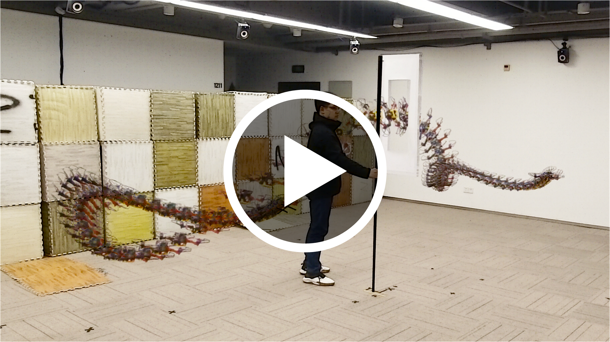
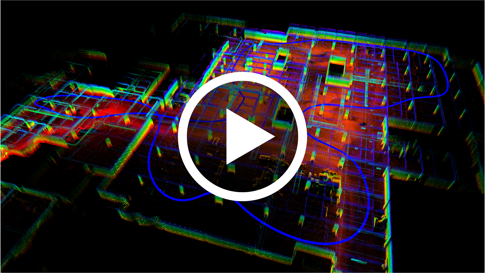
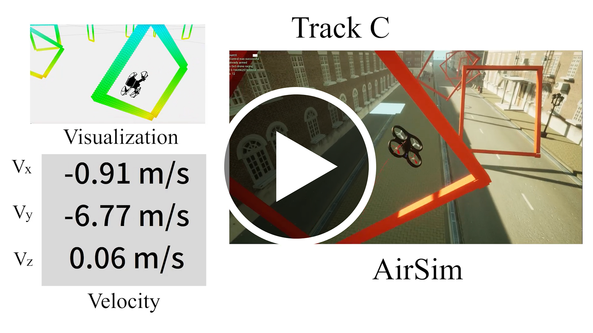
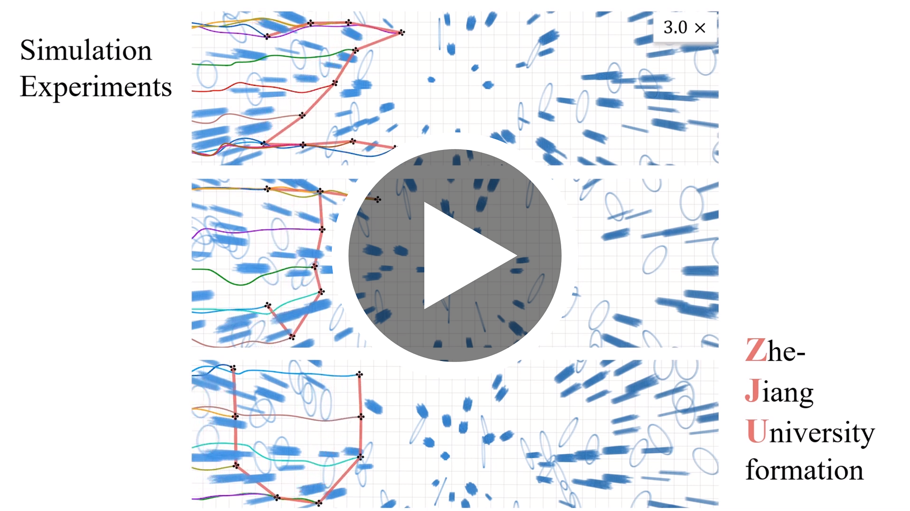

# GCOPTER

__GCOPTER__ is an efficient and versatile multicopter trajectory optimizer built upon a novel sparse trajectory representation named [__MINCO__](https://arxiv.org/pdf/2103.00190.pdf). __User-defined state-input constraints__ for dynamics involving [__nonlinear drag effects__](https://github.com/ZJU-FAST-Lab/GCOPTER/blob/main/misc/flatness.pdf) are supported.

## Updates

* **Mar 11, 2022** - A minimal but non-trivial example for global kinodynamic planning is released. Modules for trajectory optimization, quadcopter dynamics with nonlinear drags, [fast iterative region inflation for corridor generation](https://github.com/ZJU-FAST-Lab/GCOPTER/blob/main/gcopter/include/gcopter/firi.hpp), non-uniform MINCO (s=3), etc., are released.

* **Mar 15, 2022** - Released non-uniform MINCO for s=2 and s=4.

* **May 19, 2022** - Released a doc to detail [differential flatness for multicopters under nonlinear drag effects](https://github.com/ZJU-FAST-Lab/GCOPTER/blob/main/misc/flatness.pdf). Add code links for all projects powered by MINCO.

* **Plan** - __More examples are on the way__, including uniform MINCO (s=2,3,4), trajectory generation for tube-shaped and sphere-shaped corridors, local replanner, whole-body SE(3) planner, interfaces for external constraints, augmented Lagrangian, and so on.

## About

If our repo helps your academic projects, please cite our paper. Thank you!

__Author__: [Zhepei Wang](https://zhepeiwang.github.io) and [Fei Gao](https://scholar.google.com/citations?hl=en&user=4RObDv0AAAAJ) from [ZJU FAST Lab](http://zju-fast.com).

__Paper__: [Geometrically Constrained Trajectory Optimization for Multicopters](https://arxiv.org/abs/2103.00190), Zhepei Wang, Xin Zhou, Chao Xu, and Fei Gao, <em>[IEEE Transactions on Robotics](https://doi.org/10.1109/TRO.2022.3160022)</em> (__T-RO__), Regular Paper.
```
@article{WANG2022GCOPTER,
    title={Geometrically Constrained Trajectory Optimization for Multicopters}, 
    author={Wang, Zhepei and Zhou, Xin and Xu, Chao and Gao, Fei}, 
    journal={IEEE Transactions on Robotics}, 
    year={2022}, 
    volume={}, 
    number={}, 
    pages={1-20}, 
    doi={10.1109/TRO.2022.3160022}
}
```

## Applications

### Example 1: Global Trajectory Planning

This is a minimal yet non-trivial example of our trajectory optimizer for real-time high-quality corridor and global trajectory generation subject to dynamic constraints. For installation, the following terminal commands are helpful.
    
    sudo apt update
    sudo apt install cpufrequtils
    sudo apt install libompl-dev
    sudo cpufreq-set -g performance
    mkdir ROS; cd ROS; mkdir src; cd src
    git clone https://github.com/ZJU-FAST-Lab/GCOPTER.git
    cd ..
    catkin_make
    source devel/setup.bash
    roslaunch gcopter global_planning.launch

After conduct the command, you will see the windows for rviz and rqt_plot. Please follow the gif below for global trajectory planning in a random map.
<p align="center">
    
</p>
The angle between the arrow of 2D Nav Goal and positive x-axis (red axis) decides the relative height. You can repeat choosing the start and goal to trigger the global planning. The solution trajectory considers spatial-temporal optimality and vehicle dynamics with drag effects. Some states for trajectories, like net thrust, tilt angle, body rate are all available. The magnitudes for some of them are shown in the rqt_plot. Corridor and trajectory generation are computed in real-time. Physical parameters in standard units are all modifiable in a config file. If you only wants a point-mass model to achieve a faster computing, please modify the penalty-functional-relevant code.

## Projects Supported by GCOPTER or MINCO

- Robust Real-Time SE(3) Planning: [youtube](https://www.youtube.com/watch?v=pQ4oSf1rdBU) or [bilibili](https://www.bilibili.com/video/BV1bb4y1X7VE/). (__Reported by [IEEE Spectrum Website](https://spectrum.ieee.org/)!__)
<a href="https://www.youtube.com/watch?v=pQ4oSf1rdBU" target="blank">
    <p align="center">
        
    </p>
</a>

- High-Speed FPV Flight Planning: [youtube](https://www.youtube.com/watch?v=QQS0AM3iOmc) or [bilibili](https://www.bilibili.com/video/BV1pq4y1z7Jp).
<a href="https://www.youtube.com/watch?v=QQS0AM3iOmc" target="blank">
    <p align="center">
        
    </p>
</a>

- Multicopter Swarms Planning: [youtube](https://www.youtube.com/watch?v=w5GDMpjAoVQ) or [bilibili](https://www.bilibili.com/video/BV1gK4y1g7F7). (__Reported by [IEEE Spectrum Website](https://spectrum.ieee.org/)!__) [Code](https://github.com/ZJU-FAST-Lab/EGO-Planner-v2)
<a href="https://www.youtube.com/watch?v=w5GDMpjAoVQ" target="blank">
    <p align="center">
        
    </p>
</a>

- Long-Distance Drone Racing Planning: [youtube](https://www.youtube.com/watch?v=oIqtN3zWIhM) or [bilibili](https://www.bilibili.com/video/BV1sq4y1779e). (__Published in [IEEE RA-L](https://ieeexplore.ieee.org/document/9543598)__) [Code](https://github.com/ZJU-FAST-Lab/Fast-Racing)
<a href="https://www.youtube.com/watch?v=oIqtN3zWIhM" target="blank">
    <p align="center">
        
    </p>
</a>

- Gaze Teleoperation Planning: [youtube](https://www.youtube.com/watch?v=WYujLePQwB8) or [bilibili](https://www.bilibili.com/video/BV1Yf4y1P74v). (__Published in [IEEE RA-L](https://doi.org/10.1109/LRA.2022.3153898)__) [Code](https://github.com/ZJU-FAST-Lab/GPA-Teleoperation)
<a href="https://www.youtube.com/watch?v=WYujLePQwB8" target="blank"> 
    <p align="center">
        
    </p>
</a>

- Formation Keeping Planning: [youtube](https://www.youtube.com/watch?v=lFumt0rJci4) or [bilibili](https://www.bilibili.com/video/BV1qv41137Si). (IEEE ICRA) [Code](https://github.com/ZJU-FAST-Lab/Swarm-Formation)
<a href="https://www.youtube.com/watch?v=lFumt0rJci4" target="blank"> 
    <p align="center">
        
    </p>
</a>

- A variety of applications powered by __GCOPTER__ or __MINCO__ are not listed here, such as [visibility-aware aerial tracking](https://arxiv.org/abs/2109.07111), and [planning with nonlinear drag effects](https://arxiv.org/abs/2109.08403), etc.

## Powerful Submodules
- [SDLP: Seidel's Algorithm](https://github.com/ZJU-FAST-Lab/SDLP) on Linear-Complexity Linear Programming for Computational Geometry.
- [VertexEnumeration3D](https://github.com/ZJU-FAST-Lab/VertexEnumeration3D): Highly Efficient Vertex Enumeration for 3D Convex Polytopes (Outperforms [cddlib](https://github.com/cddlib/cddlib) in 3D).
- [LBFGS-Lite](https://github.com/ZJU-FAST-Lab/LBFGS-Lite): An Easy-to-Use Header-Only L-BFGS Solver.
